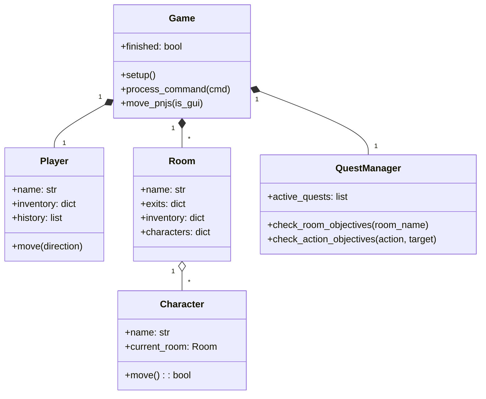

# 🏰 TBA : The Promised Neverland - Évasion de Grace Field House

Ce projet est un jeu d'aventure textuel (Text-Based Adventure) développé en Python, inspiré de l'univers du manga *The Promised Neverland*.

---

## 📖 1. Guide Utilisateur

### 🌍 L'Univers et le Scénario
Vous incarnez un enfant vivant à **Grace Field House**. Ce qui semblait être un paradis est en réalité une ferme où les enfants sont élevés pour être livrés à des démons. 

**L'intrigue :** Vous avez découvert la vérité. Avec l'aide de Norman et Emma, vous devez organiser une évasion avant la prochaine "livraison". Mais attention : **Maman Isabella** surveille chaque recoin et ses déplacements sont imprévisibles.

### 🧭 La Quête
Votre mission se déroule en trois étapes clés :
1. **Exploration** : Fouiller l'orphelinat pour localiser les objets de survie indispensables.
2. **Collecte** : Récupérer la **lampe** pour voir dans les zones sombres et la **clé** pour accéder aux zones verrouillées.
3. **L'Évasion** : Une fois la **corde** obtenue, rejoindre le **Carrefour** pour franchir le mur et gagner la liberté.

### 🏆 Conditions de Victoire et Défaite
* **Victoire** : Atteindre le lieu **Carrefour** avec la **corde** dans l'inventaire après avoir accompli les quêtes préparatoires (lampe et clé).
* **Défaite** : Être surpris par **Isabella** dans la même pièce (Game Over immédiat).

### ⌨️ Commandes du jeu
* **`go <direction>`** : Se déplacer (N, S, E, O, U, D).
* **`look`** : Observer la pièce, les objets et les personnages présents.
* **`take <objet>`** : Ramasser un objet.
* **`talk <nom>`** : Interagir avec un PNJ pour obtenir des indices.
* **`check`** : Consulter votre inventaire et le poids transporté.
* **`quests`** : Afficher vos objectifs et votre progression.
* **`history`** : Voir la liste des pièces visitées.
* **`back`** : Revenir à la pièce précédente.
* **`help`** : Afficher l'aide des commandes.

### 🚀 Installation et Lancement
1. **Prérequis** : Python 3.10 ou supérieur installé.
2. **Installation** : Clonez ce dépôt et placez-vous à la racine du dossier.
3. **Lancement (Interface Graphique)** : 
   ```bash
   python game.py
   ```
4. **Lancement (Mode Console)** : 
   ```bash
   python game.py --cli
   ```

---

## 🛠️ 2. Guide Développeur

### Architecture Logicielle
L'architecture repose sur une séparation claire entre le moteur de jeu, les entités (Joueur, PNJ) et le gestionnaire de quêtes pour permettre une maintenance évolutive.

### Diagramme de classes (Mermaid)
Ce diagramme représente la structure globale des classes du projet.



---

## 🚀 3. Perspectives de Développement

Pour enrichir l'expérience de jeu, voici les pistes de développement envisagées pour les futures versions :

1. **Système de discrétion** : Ajout d'une jauge de bruit. Plus le joueur transporte d'objets lourds, plus Isabella a de chances de détecter sa position.
2. **Brouillard de guerre** : Les descriptions des pièces adjacentes restent masquées tant que le joueur n'a pas utilisé la `lampe_de_poche`.
3. **Mécanique de Diversion** : Possibilité d'utiliser des objets (comme une horloge) pour faire du bruit dans une salle distante et ainsi attirer Isabella loin du joueur.
4. **Gestion de la "Livraison" (Timer)** : Introduction d'un compteur de tours limitant le temps disponible pour s'échapper.
5. **Alliés et Compétences** : Permettre de recruter des PNJ

6. **Ajout de dilemmes moraux** : Permettre la possibilité de s'enfuir avec les autres enfants ou non impactant grandement la diffculté du jeu
